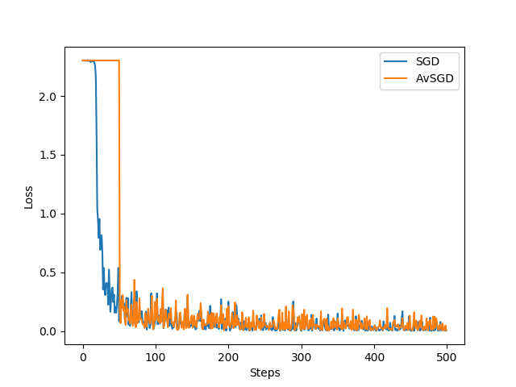

# Tensorflow ASGD Optimizer


#### Custom Asynchronous Stochastic Gradient Descent Optimizer in Tensorflow.
It works like PyTorch ASGD.
https://pytorch.org/docs/stable/_modules/torch/optim/asgd.html#ASGD
###### You can import it:
```
from TensorFlowASGD import AsynchronousStochasticGradientDescent
```
###### and use replace the optimizer tha you used:
```
optimizer = AsynchronousStochasticGradientDescent()
```

#### A simple LeNet example:
